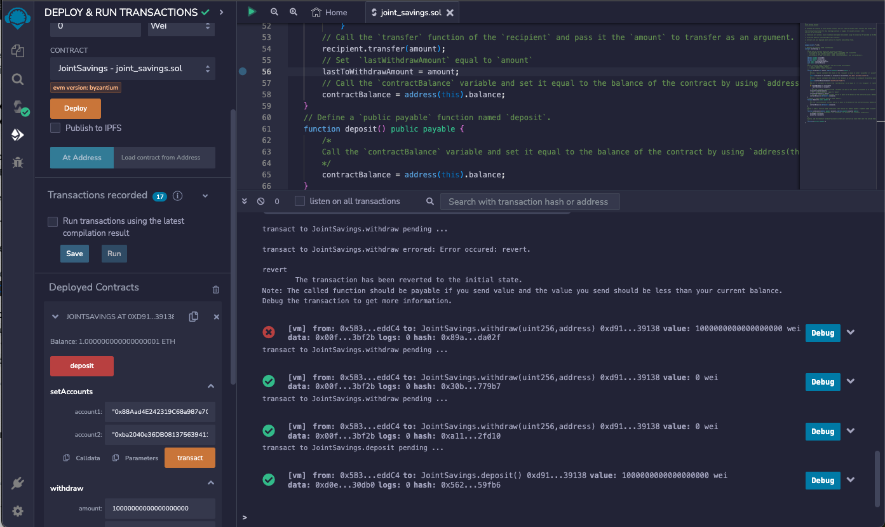

# JointLedgerSolidity

# Objective
Solidity Smart Contracts will be using Ethereum-compatible blockchain that will connect the financial institutions providing a joint-savings account.

# Actionable

1) Develop a Joint Savings Account Contract in Solidity
2) Compile and Deploy Smart Contract in the JavaScript VM
3) Confirm functionality and user-interaction with Deployed Smart Contract

Dummy Accounts: 
* Account 1: 0x88Aad4E242319C68a987e7CCE6aC394ef5c3bf2b 
* Account 2:  0xba2040e36DB08137563941153070AA2285eD277A 

# Testing Functionality
___
## Deposit functionality 

### Transaction #1 - Depositing 1 eth
  

### Transaction #2  - Depositing 10 eth
  

### Transaction #3  - Depositing 5 eth
  

## Withdraw function

### Transaction #4  - Withdrew 5 eth from Account 1
  

### Transaction #5  - Withdrew 10 eth from Account 2
  
 
## Dependencies & Resources
- Ethereum Unit Converter https://eth-converter.com/
- Ethereum Blockchain Development Tool remix.ethereum.org 

## Files 
- Deployment_of__SmartContract (Screenshots of pre and post deployment of smart contract)
- Execution_Results (Screenshots of Testing Functionality)
- joint_saving.sol
